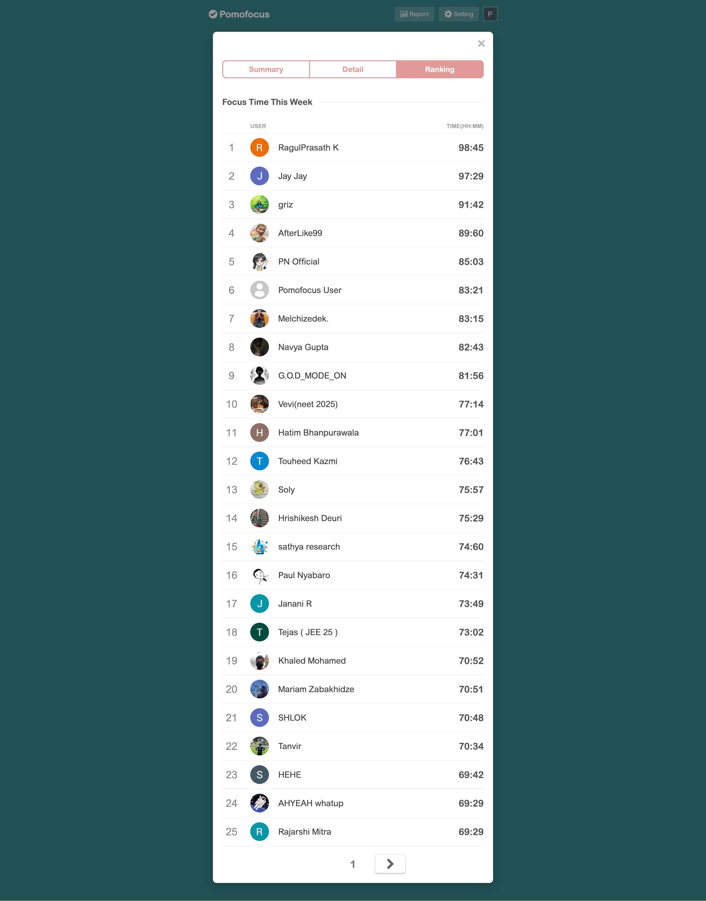
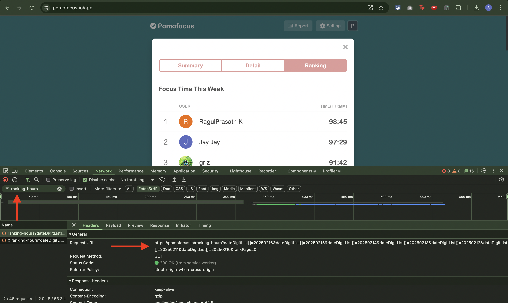
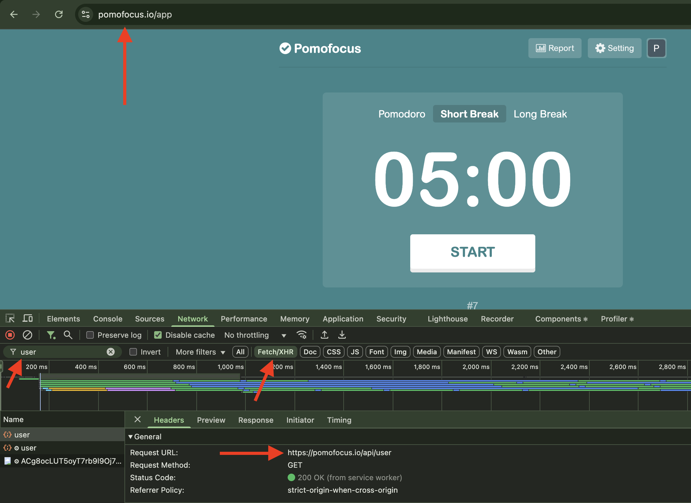
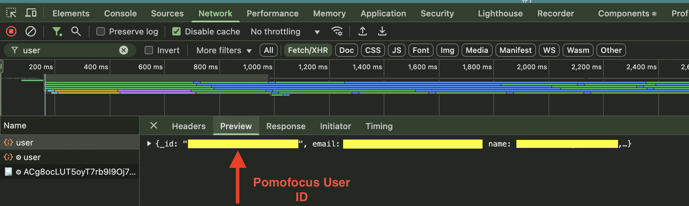

## 🎯 Pomofocus Rank Finder
A Go program that helps you find your ranking position on [Pomofocus.io](https://pomofocus.io) using either sequential or concurrent search approaches.

### Why I Built This
As a user of [Pomofocus.io](https://pomofocus.io) for tracking my productive hours, I frequently found myself wanting to check my ranking among other users. While [Pomofocus.io](https://pomofocus.io) provides a ranking page, it doesn't offer a direct way to find your position. Instead, you need to manually navigate through multiple pages to locate your name – a tedious and time-consuming process.

This is the ranking page:
> 

This script automates that search process. It efficiently scans through the ranking pages to find your position, saving you from the manual effort of clicking through numerous pages. The tool supports both sequential and concurrent search approaches, making the ranking lookup quick and hassle-free.

This is the api endpoint that returns the ranking page data:
> 

What started as a personal frustration turned into a practical solution that I hope other [Pomofocus.io](https://pomofocus.io) users will find helpful.

### ✨ Features

- 🔍 Search for a user's ranking using their Pomofocus user id
- 🚀 Two search approaches:
  - 📝 Sequential search: searches through ranking pages one by one
  - ⚡️ Concurrent search: utilizes 5 workers to search through ranking pages simultaneously

### 💻 How to run the project locally?

1. Clone the repository
```bash
git clone https://github.com/skamranahmed/pomofocus-rank-finder
```

2. Navigate to the repository directory
```bash
cd pomofocus-rank-finder
```

3. Run the program with the following command:
```bash
go run main.go -userId=YOUR_POMOFOCUS_USER_ID [-approach=sequential|concurrent] [-workerCount=NUMBER_OF_WORKERS]
```

### How to obtain your Pomofocus User ID?
1. Visit [Pomofocus.io](https://pomofocus.io) and create an account.

2. Open the network tab of the browser that you are using and filter by keyword
    > 

3. Check the API response
    > 

### 🎮 Parameters

- `-userId`: (Required) Your Pomofocus user ID
- `-approach`: (Optional) Search approach to use
  - `sequential`: Default. Searches through pages sequentially
  - `concurrent`: Uses multiple workers to search concurrently
- `-workerCount`: (Optional) Number of concurrent workers
  - Default: 5
  - Only applicable when using concurrent approach

### 📝 Examples

Sequential search:
```bash
go run main.go -userId=abcd
```

Concurrent search:
```bash
go run main.go -userId=abcd -approach=concurrent
```

Concurrent search with custom worker count:
```bash
go run main.go -userId=abcd -approach=concurrent -workerCount=10
```

### 🛠 How It Works

1. The program fetches ranking data from Pomofocus.io's API
2. It searches through ranking pages to find the specified user ID
3. When found, it displays your rank
4. The search continues until either:
   - The user ID is found in any of the ranking pages
   - The ranking page api starts giving empty results

### 🔄 Search Approaches

#### 📝 Sequential Search
- Searches through ranking pages one at a time
- Simple and straightforward approach
- Suitable for lower ranking positions

#### ⚡️ Concurrent Search
- Utilizes 5 worker goroutines to search multiple pages simultaneously
- More efficient for higher ranking positions
- Implements context cancellation to stop other workers once the ID is found

### License

This project is licensed under the [MIT License](https://choosealicense.com/licenses/mit/)